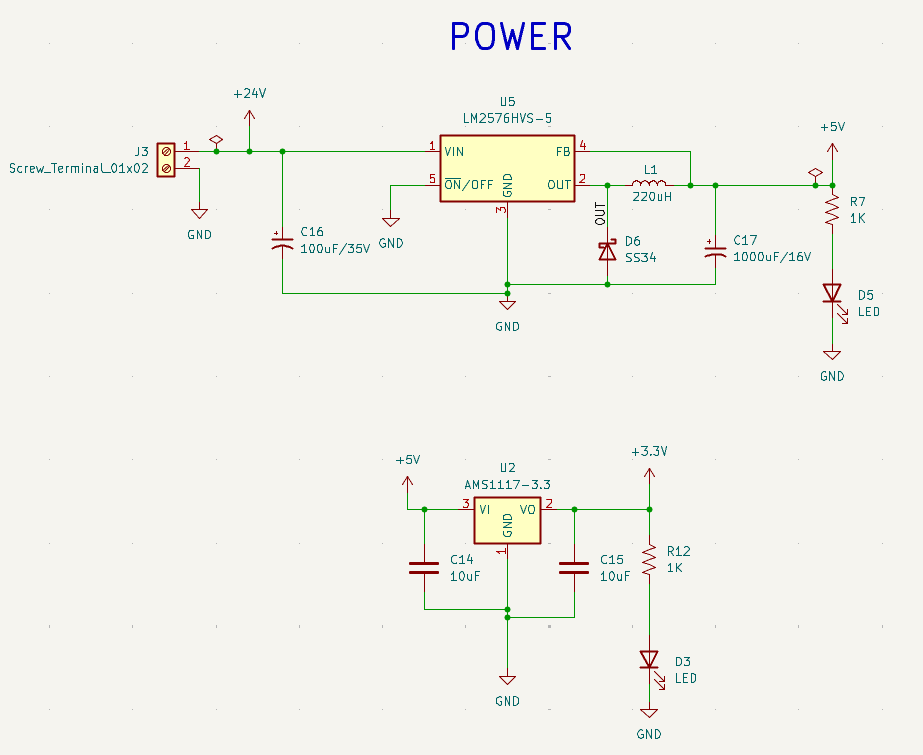
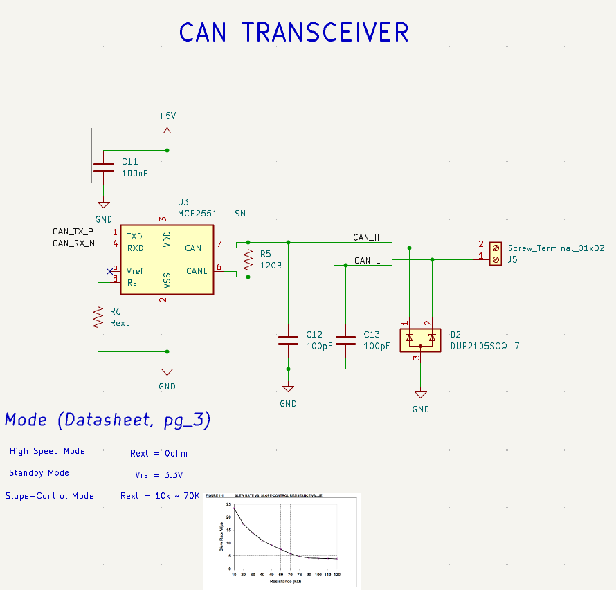
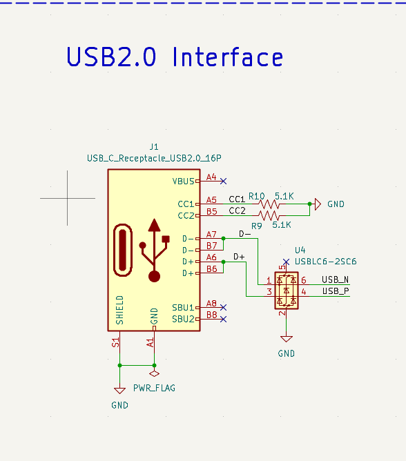
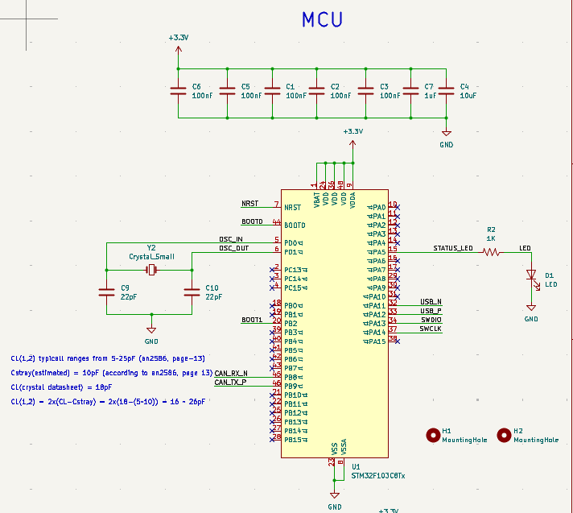
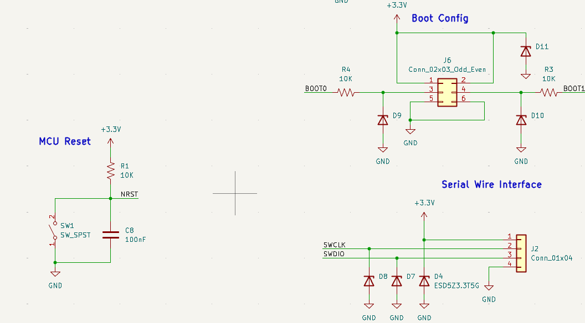
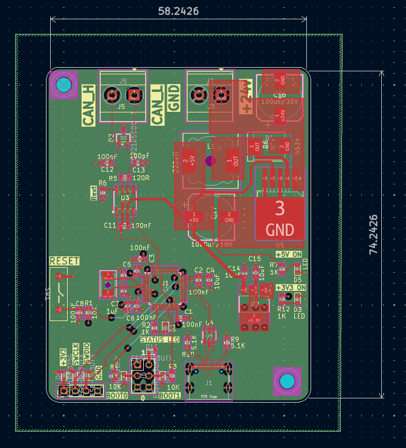
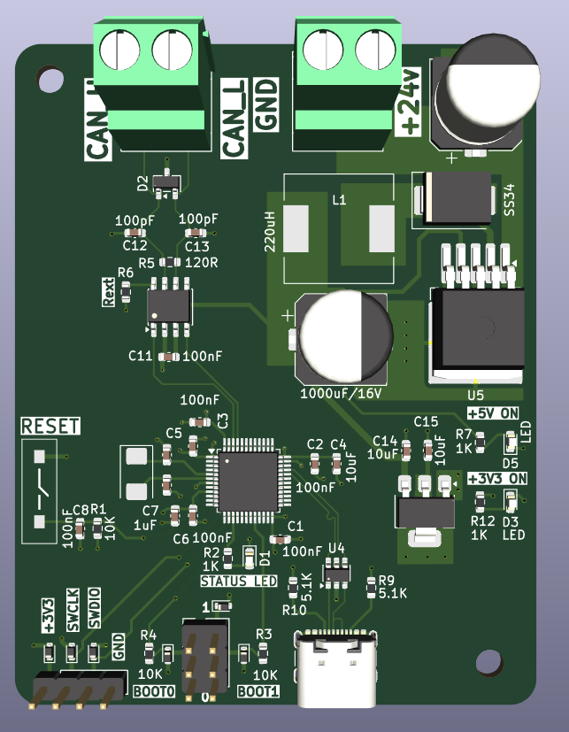
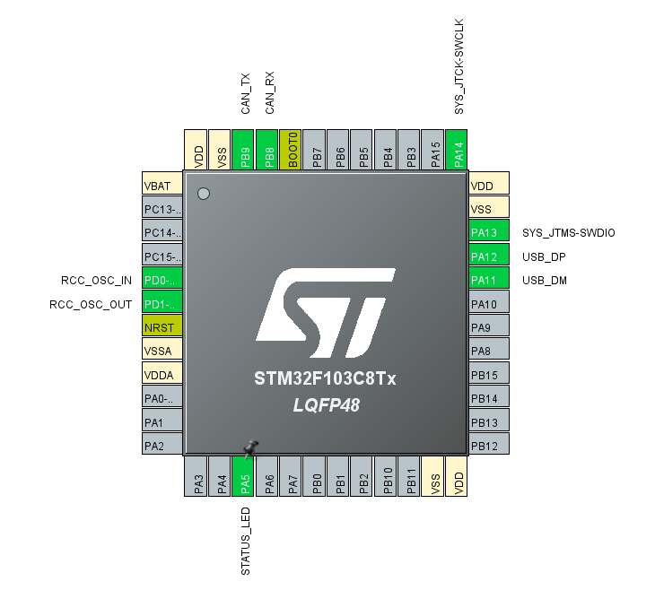
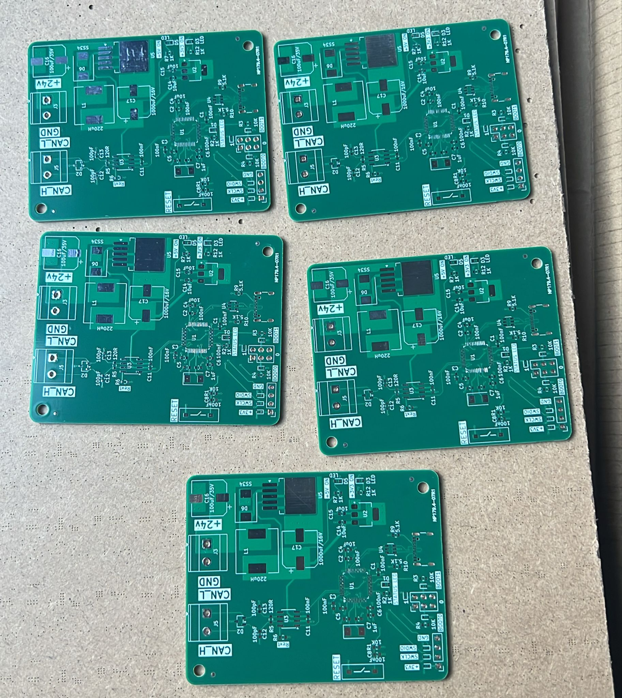

# can-node-pcb
Compact CAN node PCB using STM32F103C8T6 and MCP2551, featuring a 24V→3.3V power stage (LM2576HV + AMS1117) and a USB 2.0 interface for laptop communication and data logging.

# SCHEMATIC

# LAYOUT

# PINOUT

# Final Board

